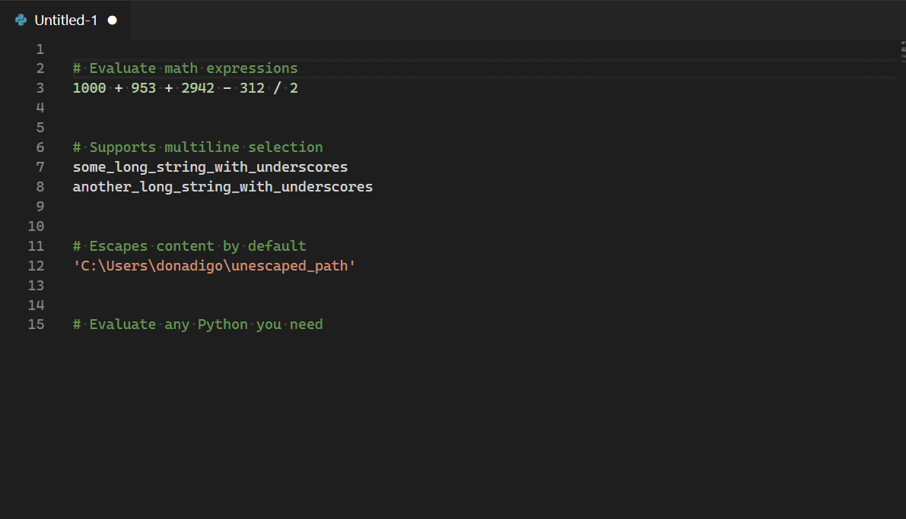
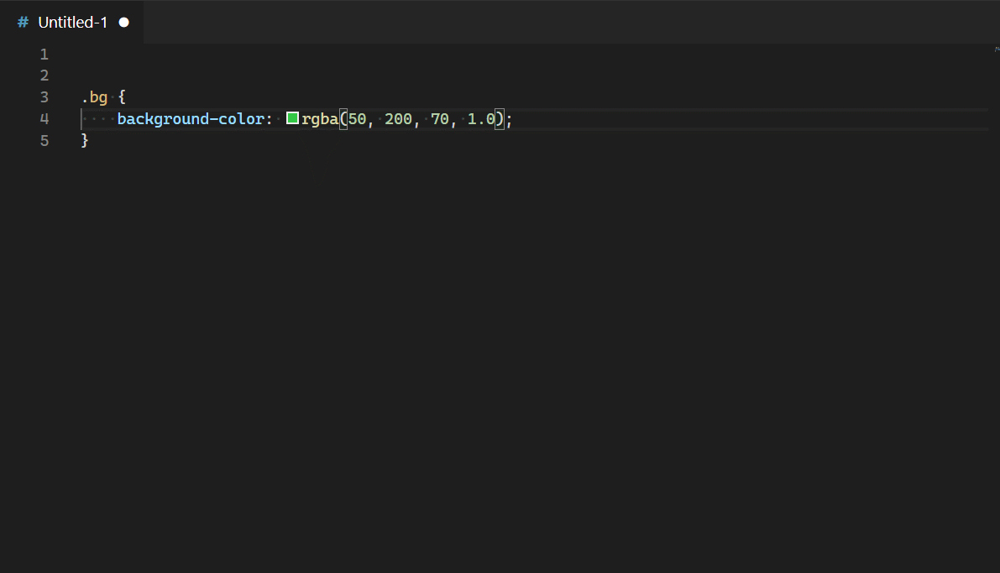

# Inline Python

A little VSCode extension that allows to execute & evaluate Python code inline. Supports transforming multi-line selections and accessing functions defined in a preload script.

## Usage
Select a snippet you want to transform with python code, press Ctrl+Shift+P, search "Insert Python Code" and press enter. Enter your Python code and press enter to submit. Any errors are also displayed inline.

### Supports preloading a custom script with your defined Python functions:

## Extension Settings
This extension contributes the following settings:

* `inlinepython.preloadScriptPath`: Path to a Python script that will be loaded with the interpreter. (Requires restart)
* `inlinepython.execTimeout`: The timeout in milliseconds before a query is stopped from executing

